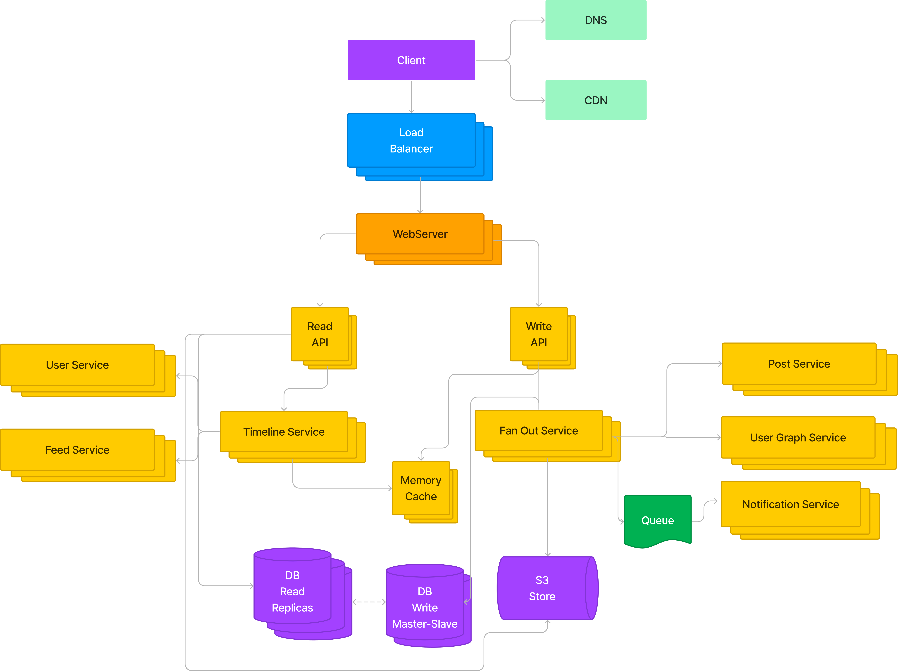

# Instagram System Design 
  

## Functional Requirements:

1.  Users should be able to upload and view photos and videos
    
2.  Users should have the ability to like and comment on posts
    
3.  Each user should have a custom news feed from the recommendation algorithm
    
    
## Non-functional requirements:  
  
1.  The system should prioritize high availability and low latency while viewing videos and photos
    
2.  The system should be optimized for heavy workloads and with a fatty read-to-write ratio
    
3.  The system should be reliable so that no uploaded videos or photos are lost
    
    
## Capacity estimations:

1.  500 million Daily Active Users
    
2.  Around 1 billion photo posts per month.
    
3.  Approximately 1 million video posts per month
    
4.  About 10 billion comments per month
    
5.  About 30 billion post likes per month
    
6.  About 5 billion news-feed reads per day
    
## System Requirements:

1.  Average photo 150kb * 1 billion = 150 terabytes per month, but we need to store at different servers for not to lose the photo and better availability in different regions, so 150 terabytes * 3 = 450 terabytes per month
    
2.  Average video (1-60 seconds) ~6 mbytes * 10.000.000 = 6 terabytes per month = 6 * 3 = 18 terabytes per month
    
3.  Storage size for metadata: ~9 tb per month for user profiles/posts/comments
    
4.  Storage size for 5 years  = ~200 * 12 * 5 = ~12 petabytes
    
5.  Bandwidth for uploading photos and videos ~50 GB/sec at peak times
    
6.  RPS for news feed update ~58000 RPS
    
## Architecture Diagram:

## Technologies:

### WebServer

 **Nginx**  
*Nginx* is a web server that can also be used as a reverse proxy, load balancer, mail proxy, and HTTP cache. 

**Strengths:**
- **Performance**: Nginx is well-known for its high performance and low memory footprint. It can serve a large number of concurrent requests, which makes it an excellent choice for high-traffic applications.
- **Static Content**: Nginx is excellent for serving static content quickly and efficiently, improving the overall response time of your application.
	 
**Trade Offs:**
- **Dynamic Content**: While Nginx can serve dynamic content by interfacing with fastCGI, it's typically not its strong suit compared to other options like Apache. For applications with heavy dynamic content, you might need to use it in combination with other servers or tools.

### Database

**Apache Cassandra**
It is a highly scalable and distributed NoSQL database designed to handle large amounts of data across many commodity servers, providing high availability with no single point of failure.

**Strengths:**

 - **Scalability:** Cassandra is highly scalable; it allows to add more hardware to accommodate more customers and more data as per demand.
 - **Distributed:** Data is automatically replicated to multiple nodes for fault-tolerance. Replication across multiple data centers is also supported.
 - **High performance:** Cassandra is designed to handle high write throughput and still ensure low latency.

**Trade Offs**

 - **Complexity** Cassandra can be complex to set up and manage. It also has a steep learning curve.
 - **Consistency** As per the CAP theorem, Cassandra gives up consistency over availability and partition tolerance. While it does provide eventual consistency, this might not be suitable for all applications.

### Media Storage

**Amazon S3**

**Strengths:**

 - **Scalability and Durability:** S3 scales storage according to need and guarantees high durability of objects.
 - **Security:** It includes a range of configurable security options including encryption for data at rest.
 - **Cost-effective**: You only pay for what you use and there are various storage classes to help optimize costs.

**Trade Offs**

 - **Costs can scale**: While it is cost-effective, costs can scale with usage and can become significant at large scales.
 - **Data transfer speed**: Depending on the geographical distance between the server and the end user, you may experience latency when accessing the media files. This can be mitigated using a Content Delivery Network (CDN) like Amazon CloudFront.

## Single Points Of Failure and Bottlenecks

1. **Database**

Bottleneck: If there is a high volume of read and write operations, the database could become a bottleneck. For instance, heavy write operations in Cassandra might slow down read operations because of how data is written and stored. Similarly, a high volume of read operations can slow down the system if the data is not properly distributed and cached.

2. **Load Balancers**:

SPOF: If the load balancer goes down, the entire system can become unreachable. To mitigate this, redundant load balancers are often used in a high-availability setup.

3. **Web Servers**:

Bottleneck: Web servers can become a bottleneck if they can't handle the number of incoming connections. This can occur if there are too many open connections, or if the servers do not have enough resources (CPU, memory) to process the requests.

4. **Storage for Media (like Amazon S3)**:

If the storage service goes down, all media becomes inaccessible. This is typically mitigated by the inherent redundancy and high availability provided by services like S3.
