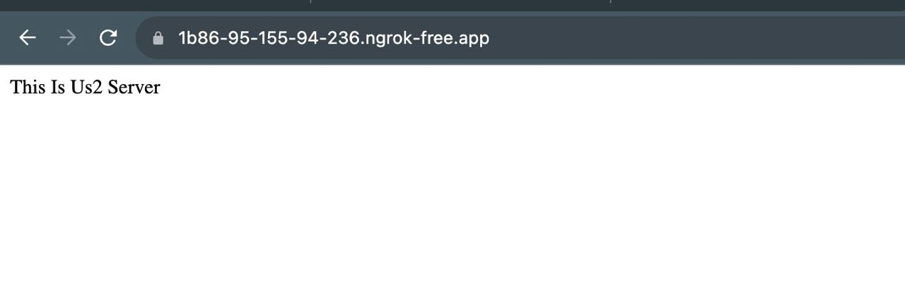

# NGINX Load Balancer Configuration

## Introduction

This project sets up a load balancer on NGINX to distribute incoming traffic based on geographic location. We have designated specific servers for the UK and the US, and another server for all other traffic. In the event of a server failure, a backup server is in place to handle traffic.

## Tools Used

-   **NGINX** for load balancing.
-   **ngx_http_geoip2_module** for geolocation-based load balancing.
-   **ngrok** to expose the local server to the internet.
-   **Touch VPN Chrome extension** to test geo-based redirection.

## Configuration Details

### NGINX Setup

The `nginx.conf` file contains the configuration for the load balancer. The traffic distribution is based on the country code of incoming requests. Here's a brief summary:

-   Traffic from the US is distributed between two servers (`us1` and `us2`).
-   Traffic from the UK is sent to a single server (`uk1`).
-   All other traffic is sent to a default server.
-   A backup server (`backup`) is set to handle traffic if any of the primary servers fail.

### Health Checks

Passive health checks are set up with the following parameters:

-   `max_fails`: 3 for US and UK servers, 1 for PL server.
-   `fail_timeout`: 1 second.

If a server reaches the `max_fails` count within the `fail_timeout` duration, the backup server will take over.

## Proof of Results

Please find the results in the images provided:

-   
-   
-   
-   

## Future Improvements

1.  Consider setting up active health checks for more immediate and consistent server monitoring.
2.  Expand the list of countries and servers for more detailed traffic distribution.
3.  Implement SSL/TLS for secure communication.