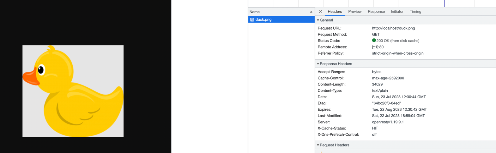
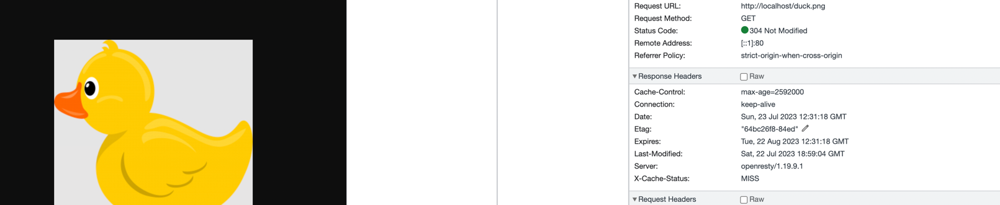

# Nginx With the ability to purge images

## Installing:

`docker-compose up --build`

## Get the image/Purge it

http://localhost/duck.png - Got to this page in browser 2 times for caching the image

http://localhost/purge/duck.png - Purge Image

## Proofs

*Before Purging*:

*Purging Effect*:

*After Purge*:

